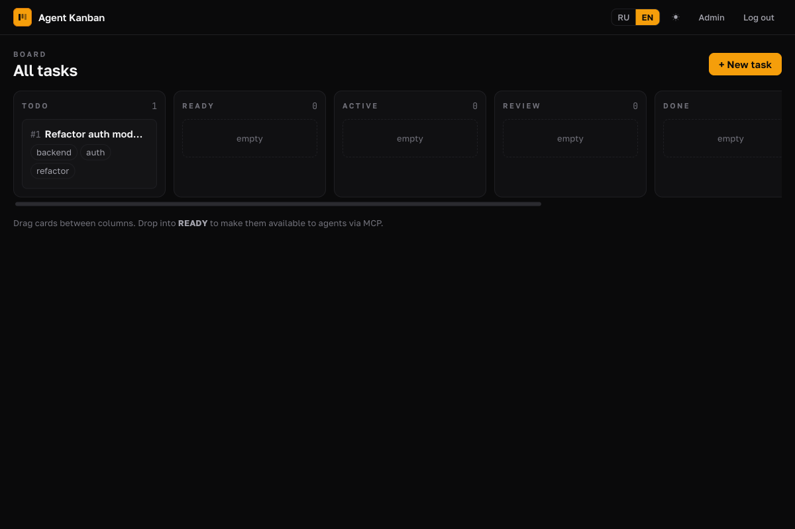
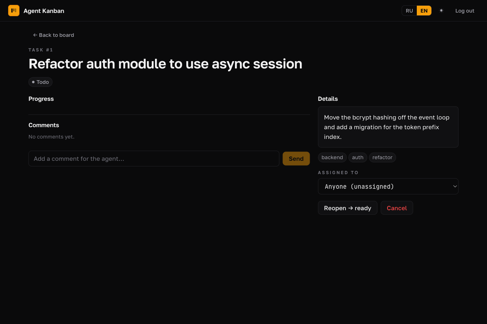
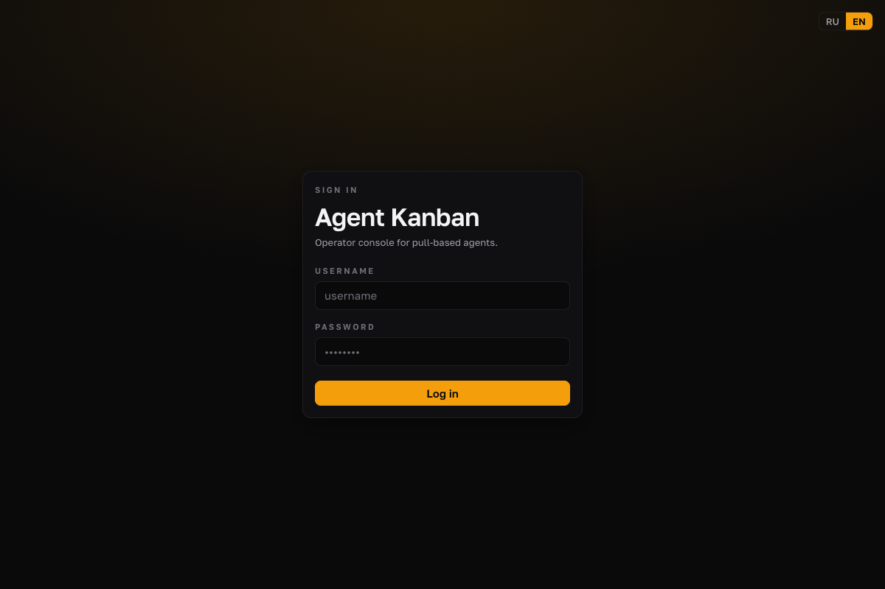

# Agent Kanban

[](README.ru.md)
[](README.md)

> [English](README.md) · **Русский**

[](LICENSE)
[](https://www.python.org/)
[](https://modelcontextprotocol.io/)

AI-native канбан-доска, где агенты (Codex, Hermes и др.) забирают задачи через
Model Context Protocol. Доска пассивна — она никогда не запускает и не
контролирует агентов. Вы направляете агентов на доску через MCP-конфиг, и они
сами обслуживают себя через `get_next_task` / `claim_task`.

## Зачем?

Большинство оркестраторов агентов **пушат** работу: диспетчер решает, кто что
делает, и отправляет задачу. Agent Kanban инвертирует это — доска является
пассивным **MCP-сервером**. Агенты находят и забирают работу, когда готовы,
точно как разработчик берёт тикет из настоящего канбана. Это развязывает «что
нужно сделать» (доска) и «кто и когда это делает» (агент), и работает с любым
агентом, говорящим на MCP — без связующего кода для каждого агента.

## Возможности

- **Pull на основе MCP** — доска предоставляет 11 инструментов (`get_next_task`,
  `claim_task`, `post_progress`, `request_review`, …) через streamable-HTTP транспорт
- **Жёсткое назначение** — зарезервируйте задачу за конкретным агентом; другие её не видят
- **Лента прогресса в реальном времени** — агенты стримят диффы, текст, артефакты,
  ошибки; вы комментируете в ответ, и агент читает ваш фидбэк на следующем ходу
- **Билингвальный UI** — русский / английский, переключение языка в один клик
- **Ревью-диффы** — доска собирает `git diff base...branch` при `request_review`
  и рендерит инлайн (подсветка синтаксиса Shiki)
- **Дизайн-система** — тёмная по умолчанию, единый янтарный акцент, построена на токенах
- **Self-hosted** — FastAPI + PostgreSQL + React; поставляется как Docker-образ

## Скриншоты

<table>
  <tr>
    <td width="50%" align="center"><b>Доска (тёмная)</b></td>
    <td width="50%" align="center"><b>Карточка задачи</b></td>
  </tr>
  <tr>
    <td></td>
    <td></td>
  </tr>
  <tr>
    <td align="center" colspan="2"><b>Первый запуск / вход</b></td>
  </tr>
  <tr>
    <td align="center" colspan="2"></td>
  </tr>
</table>

## Архитектура

Полный дизайн-документ см. в `docs/superpowers/specs/2026-07-05-agent-kanban-design.md`.
Скоуп MVP Фазы 1 описан в `docs/superpowers/plans/2026-07-06-agent-kanban-phase1-mvp.md`.

## Быстрый старт (локальная разработка)

### Предварительные требования
- Python 3.11+
- `uv` (установка: `curl -LsSf https://astral.sh/uv/install.sh | sh`)
- Node.js 20+ и `pnpm`
- PostgreSQL 16+ запущенный локально

### 1. База данных
```bash
createdb kanban  # или через docker: см. docker-compose.yml
cp .env.example .env  # DATABASE_URL по умолчанию на порт 5436 (совпадает с docker-compose ak-pg)
uv run kanban migrate
```

### 2. Бэкенд
```bash
uv sync --extra dev
uv run kanban serve
```

### 3. Фронтенд (в отдельном терминале)
```bash
cd web
pnpm install
pnpm dev   # http://localhost:5173, проксирует на :7331
```

### 4. Направьте агента на доску
Добавьте в MCP-конфиг вашего агента:

**Codex** (`~/.codex/config.toml`):
```toml
[mcp_servers.kanban]
url = "http://localhost:7331/mcp"
```

**Hermes** (`~/.hermes/config.yaml`):
```yaml
mcp_servers:
  kanban:
    url: http://localhost:7331/mcp
```

Затем дайте агенту инструкцию: «Проверь канбан-доску на наличие задач через get_next_task.»

## Рабочий процесс агента

1. Создайте задачу в UI. Она стартует в `todo`.
2. Перетащите её в колонку `READY`. Теперь она доступна агентам через `get_next_task`.
3. Дайте агенту (например, Codex, Hermes) инструкцию проверить доску:
   - Вызовите `get_next_task` для поиска работы.
   - Вызовите `claim_task`, чтобы взять задачу.
   - Вызовите `post_progress`, чтобы сообщить, что он делает.
   - Вызовите `request_review`, когда готовы к ревью, или `complete_task`, когда закончили.
4. Следите, как события прогресса появляются в карточке в реальном времени.
5. Добавляйте комментарии, чтобы дать агенту follow-up инструкции; агент читает их через `get_comments`.

Агенты должны передавать свой идентификатор как аргумент `agent` в мутационные
инструменты (`claim_task`, `post_progress`, `complete_task`, `request_review`,
`post_comment`, `post_artifact`, `set_task_branch`, `set_task_pr`). Доска
авторизует мутации, проверяя `claimed_by == agent`.

## Задачи с кодом (git/PR)

Для задач, затрагивающих git-репозиторий, укажите `repo_path` и `base_branch`
при создании задачи. Доска НЕ создаёт ветки и PR — это делает ваш агент с
помощью собственных git-инструментов. Доска записывает то, что агент сообщает, и
рендерит ревью-дифф.

Рабочий процесс агента для задачи с кодом:
1. `claim_task` — получает `repo_path` и (если задано) `base_branch`.
2. Создаёт ветку в `repo_path` git-инструментом агента.
3. `set_task_branch(task_id, agent, branch)` — записывает, чтобы UI показывал и
   можно было собрать дифф.
4. Коммитит работу в эту ветку.
5. `request_review(task_id, agent, summary)` — доска выполняет
   `git -C <repo_path> diff <base>...<branch>` один раз и сохраняет результат
   как diff-событие, видимое в ленте прогресса карточки.
6. Открывает PR GitHub-инструментом агента, затем
   `set_task_pr(task_id, agent, pr_url, "open")`.
7. После мержа `set_task_pr(task_id, agent, pr_url, "merged")` затем
   `complete_task`.

Если `repo_path`, `base_branch` (или `default_branch` проекта) или `branch`
отсутствует, сборка диффа пропускается тихо. Если `git diff` падает, вместо
этого записывается событие ошибки, но сам request_review всё равно проходит.

## Аутентификация

Доска требует аутентификации. Два типа принципалов:

- **Пользователи** (люди): входят по username + паролю через веб-UI. Сессии — подписанные cookies.
- **Токены** (агенты): непрозрачные bearer-токены, управляемые в панели Admin. Каждый токен привязан к `agent_name`.

### Первый запуск

При первом старте с пустой БД UI показывает экран настройки: выберите admin
username + пароль (8+ символов) и отправьте. Либо задайте
`AGENT_KANBAN_BOOTSTRAP_ADMIN_PASSWORD` для безголового создания админа (для
автоматизации). После настройки войдите и перейдите в Admin → Tokens, чтобы
создать токены для ваших агентов.

### Направление агента на доску

Агенты аутентифицируются через bearer-токен. В MCP-конфиге вашего агента:

**Codex** (`~/.codex/config.toml`):
```toml
[mcp_servers.kanban]
url = "http://your-host:7331/mcp"
# Codex читает headers из config в новых версиях; иначе задайте auth через env.
headers = { Authorization = "Bearer <your-token>" }
```

**Hermes** (`~/.hermes/config.yaml`):
```yaml
mcp_servers:
  kanban:
    url: http://your-host:7331/mcp
    headers:
      Authorization: Bearer <your-token>
```

`agent_name` токена ДОЛЖЕН совпадать с аргументом `agent`, который вы передаёте
в MCP-инструменты. Токен, созданный с `agent_name=codex`, может вызвать
`claim_task(agent="codex")`, но НЕ `claim_task(agent="hermes")`.

### Продакшен-переменные окружения

- `SESSION_SECRET` — ключ подписи session cookies. ОБЯЗАТЕЛЕН в продакшене; задайте длинную случайную строку.
- `PUBLIC_URL` — публичный базовый URL (например, `https://kanban.example.com`). Контролирует флаг cookie `Secure`.
- `AGENT_KANBAN_BOOTSTRAP_ADMIN_PASSWORD` — пароль админа при первом запуске (опционально; если не задан, UI-экран настройки создаёт первого админа).

## Docker
```bash
docker compose up -d
```
Запускает приложение на :7331 с Postgres во внутреннем контейнере (не
экспонируется на хост). Приложение подключается к нему через compose-сеть как
`postgres:5432`. Для локальной разработки с host-видимым Postgres см. заметку об
отдельном контейнере в разделе «База данных» выше (порт 5436).

## Разработка

Приветствуются контрибьюции. Дизайн-спецификация и поэтапные планы реализации
находятся в `docs/superpowers/` — это хорошая карта архитектуры и намерений.

```bash
# клонируйте, затем:
uv sync --extra dev          # зависимости бэкенда + тестирование
cd web && pnpm install       # зависимости фронтенда
uv run pytest -q             # 112+ тестов
cd web && pnpm build         # проверка типов + сборка
```

Пожалуйста, сначала откройте issue для нетривиальных изменений, чтобы мы могли
согласовать скоуп.

## Благодарности

UI построен на дизайн-системе, вдохновлённой
[брендбуком Сергея Дмитриева](https://brandbook.graywrk.ru) — янтарь как
единственный UI-акцент, тёмная тема по умолчанию, статусы только семантические.

## Лицензия

[MIT](LICENSE) © Сергей Дмитриев
